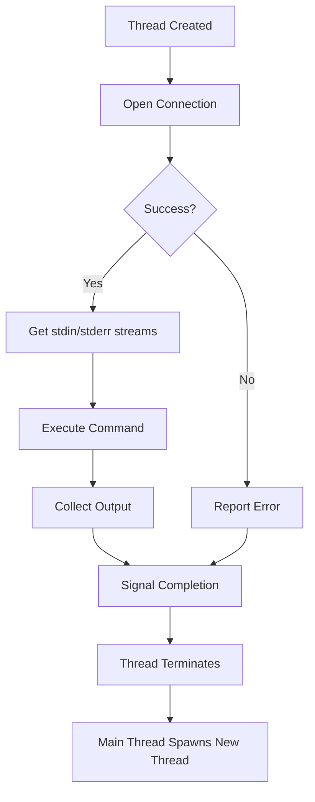

<div align="center">

# 🚀 PDSH - Parallel Distributed Shell

### Execute commands on multiple remote hosts in parallel
*Because life's too short to SSH into servers one by one*

[](COPYING)
[](src/)
[](#)
[](#)

[Features](#-key-features) • [Quick Start](#-quick-example) • [Installation](#-installation) • [Configuration](#%EF%B8%8F-configuration) • [Usage](#-usage-examples) • [Documentation](#-documentation)

</div>

---

## 📖 What is PDSH?

**Pdsh** is a multithreaded remote shell client that executes commands on multiple remote hosts **in parallel**. Scale your operations from a handful to thousands of nodes with ease.

<div align="center">

### 🎯 Key Features

</div>

<table>
<tr>
<td width="50%" valign="top">

#### 🔀 **Parallel Execution**
Run commands across multiple hosts simultaneously with configurable fanout control

#### 🧵 **Multithreaded Architecture**
Efficient connection management that scales to thousands of nodes

#### 🎛️ **Modular Design**
Dynamically loadable modules for different shell services and features

</td>
<td width="50%" valign="top">

#### 🔌 **Multiple Protocols**
Support for SSH, rsh, Kerberos IV, mrsh, and more

#### ⚡ **High Performance**
Handle massive clusters with optimized resource usage

#### 🎮 **Rich Feature Set**
Host groups, timeout controls, interactive mode, and more

</td>
</tr>
</table>

<div align="center">

### 💡 Quick Example

</div>

```bash
# Update packages on 100 web servers in parallel
pdsh -w web[01-100] 'sudo apt-get update && sudo apt-get upgrade -y'

# Check disk space across all database nodes
pdsh -g db-servers 'df -h | grep /data'

# Restart service on specific hosts
pdsh -w "node1,node2,node3" 'systemctl restart nginx'
```

---

<div align="center">

## 🎮 Usage Examples

*Common patterns and real-world scenarios*

</div>

<details>
<summary><b>🌐 Basic Host Selection</b></summary>

<br>

```bash
# Single host
pdsh -w node1 'uptime'

# Comma-separated hosts
pdsh -w node1,node2,node3 'hostname'

# Range notation
pdsh -w node[1-100] 'date'

# Multiple ranges
pdsh -w web[1-50],db[1-10] 'free -m'

# Exclude hosts
pdsh -w node[1-100] -x node[5,10,15] 'df -h'
```

</details>

<details>
<summary><b>📁 Using Host Groups</b></summary>

<br>

```bash
# Use genders group
pdsh -g webservers 'service httpd status'

# Use dsh-style group file
pdsh -g production 'tail -f /var/log/app.log'

# Use SLURM allocation
pdsh -j slurm_jobid 'hostname'

# Use machines file
pdsh -a 'w'  # Uses configured machines file
```

</details>

<details>
<summary><b>⚙️ Configuration Management</b></summary>

<br>

```bash
# Deploy configuration files
pdsh -w web[1-20] 'cat > /etc/app/config.yml' < config.yml

# Update and restart services
pdsh -w api[1-10] 'sudo apt update && sudo systemctl restart api-service'

# Check configuration drift
pdsh -w all_nodes 'md5sum /etc/important.conf'

# Synchronize time
pdsh -w cluster[1-500] 'sudo ntpdate -s time.nist.gov'
```

</details>

<details>
<summary><b>🔍 Monitoring & Diagnostics</b></summary>

<br>

```bash
# Check load across cluster
pdsh -w compute[1-100] 'uptime | grep -o "load.*"'

# Find processes
pdsh -w app[1-50] 'ps aux | grep java'

# Disk space monitoring
pdsh -w storage[1-20] 'df -h | grep -E "(/data|/backup)"'

# Memory usage
pdsh -w all_nodes 'free -m | grep Mem'

# Network connectivity test
pdsh -w cluster[1-200] 'ping -c 1 gateway.local'
```

</details>

<details>
<summary><b>🚀 Deployment Tasks</b></summary>

<br>

```bash
# Pull latest code
pdsh -w web[1-30] 'cd /app && git pull origin main'

# Restart services with rolling restart
for i in {1..10}; do
  pdsh -w "app$i" 'sudo systemctl restart app' && sleep 5
done

# Clear caches
pdsh -w memcache[1-5] 'echo "flush_all" | nc localhost 11211'

# Run database migrations
pdsh -w db-primary 'cd /app && bundle exec rake db:migrate'
```

</details>

<details>
<summary><b>🔒 Security Operations</b></summary>

<br>

```bash
# Update SSH keys
pdsh -w all_nodes 'cat >> ~/.ssh/authorized_keys' < new_key.pub

# Check for security updates
pdsh -w ubuntu[1-100] 'apt list --upgradable | grep -i security'

# Audit user accounts
pdsh -w servers[1-50] 'grep "sudo" /etc/group'

# Check firewall rules
pdsh -w edge[1-5] 'sudo iptables -L -n'
```

</details>

<details>
<summary><b>📊 Data Collection</b></summary>

<br>

```bash
# Collect logs
pdsh -w web[1-20] 'tail -100 /var/log/nginx/error.log' > collected_logs.txt

# Gather system info
pdsh -w cluster[1-100] 'uname -r; cat /etc/os-release'

# Performance metrics
pdsh -w compute[1-50] 'top -bn1 | head -20'

# Inventory hardware
pdsh -w servers[1-200] 'lscpu | grep "Model name"'
```

</details>

<div align="center">

### 💡 Pro Tips

</div>

| Tip | Command | Benefit |
|-----|---------|---------|
| **Adjust fanout** | `pdsh -f 16 -w nodes[1-1000]` | Control parallelism for stability |
| **Set timeout** | `pdsh -t 30 -w slow-nodes 'command'` | Prevent hanging on slow hosts |
| **Interactive mode** | `pdsh -w cluster[1-10]` | Enter commands interactively |
| **Different user** | `pdsh -l root -w nodes[1-50]` | Run as different user |
| **Copy files** | `pdcp -w nodes[1-20] file.txt /tmp/` | Parallel file copy |

---

<div align="center">

## ⚙️ Configuration

*Pdsh uses GNU autoconf for flexible, modular configuration*

</div>

Dynamically loadable modules for each shell service and feature are compiled based on your configuration choices.

> 💡 **Tip**: Default modules (rsh, Kerberos IV, and SDR for IBM SPs) are compiled automatically if available on your system.

<details>
<summary><b>📦 Available Modules</b></summary>

<br>

For a complete description of each module, including requirements and conflicts, see the [`README.modules`](README.modules) file.

**Popular modules include:**
- SSH remote shell service
- SLURM integration
- Genders database support
- Dsh-style group files
- Nodeupdown integration
- GNU readline for interactive mode

</details>

<details>
<summary><b>🔧 Static Module Compilation</b></summary>

<br>

If your system doesn't support dynamically loadable modules, use:

```bash
./configure --enable-static-modules
```

</details>

---

<div align="center">

## 🛠️ Build Configuration Options

*Customize your pdsh installation with these configuration flags*

</div>

### 🔐 Remote Shell Services

| Option | Description |
|--------|-------------|
| `--without-rsh` | Disable BSD rcmd(3) support (standard rsh) |
| `--with-ssh` | ✅ Enable SSH remote shell service |
| `--with-mrsh` | ✅ Enable mrsh(1) remote shell service |

### 🗂️ Host Management

| Option | Description |
|--------|-------------|
| `--with-machines=/path/to/machines` | Use flat file list for `-a` option |
| `--with-genders` | ✅ Support genders database via genders(3) library |
| `--with-dshgroups` | ✅ Support dsh-style group files (`~/.dsh/group/`) |
| `--with-netgroup` | ✅ Use netgroups (`/etc/netgroup` or NIS) |

### 🎮 Runtime Features

| Option | Description |
|--------|-------------|
| `--with-nodeupdown` | ✅ Dynamic elimination of down nodes via nodeupdown(3) |
| `--with-slurm` | ✅ Support running under SLURM allocation |
| `--with-readline` | ✅ GNU readline for interactive mode |

### ⚡ Performance Tuning

| Option | Default | Description |
|--------|---------|-------------|
| `--with-fanout=N` | 32 | Set default parallel connection fanout |
| `--with-timeout=N` | 10 | Set default connect timeout (seconds) |

<div align="center">

### 📝 Example Configuration

</div>

```bash
# Recommended configuration for modern clusters
./configure \
  --with-ssh \
  --with-genders \
  --with-slurm \
  --with-readline \
  --with-fanout=64 \
  --with-timeout=15
```

<div align="center">

> ⚠️ **Module Conflicts Warning**

</div>

Some configuration options may conflict because they perform identical operations:

| ⚠️ Conflict | Reason |
|------------|--------|
| `genders` + `nodeattr` | Both support the `-g` option |
| Multiple host management modules | Overlapping functionality |
| Static compilation | Will **fail** if conflicting modules are selected |

📖 **See the man page for complete details on module conflicts**

---

<div align="center">

## 📦 Installation

</div>

### ⚡ Quick Install

```bash
# Build and install
./configure
make
make install
```

<div align="center">

### 🔒 SetUID Configuration (Optional)

</div>

By default, pdsh installs **without setuid permissions**. For most protocols (SSH, mrsh), root permissions aren't needed.

<details>
<summary><b>⚙️ When do I need setuid root?</b></summary>

<br>

**Only if you're using** `rcmd/rsh` or `rcmd/qsh` modules:

```bash
chown root PREFIX/bin/pdsh PREFIX/bin/pdcp
chmod 4755 PREFIX/bin/pdsh PREFIX/bin/pdcp
```

> 💡 **Security Note**: Modern installations using SSH don't require setuid root

</details>

---

<div align="center">

## ⚠️ Gotchas & Known Issues

*Common pitfalls and how to avoid them*

</div>

<details open>
<summary><b>1️⃣ Reserved Socket Exhaustion</b></summary>

<br>

When using rsh, krb4, qsh, or ssh, pdsh uses **reserved sockets** (obtained via `rresvport()`):

| Resource | Limit | Usage |
|----------|-------|-------|
| Socket pool | 256 sockets | 1 per connection (2 with stderr) |
| Risk factors | Multiple pdsh instances + high fanout | Can exhaust pool |

#### 💡 Solutions

```bash
# Option 1: Use mrsh/mqsh (no reserved ports)
./configure --with-mrsh

# Option 2: Reduce fanout at build time
./configure --with-fanout=32

# Option 3: Reduce fanout at runtime
pdsh -f 16 -w hosts 'command'
```

</details>

<details open>
<summary><b>2️⃣ TCP Wrappers Bottlenecks</b></summary>

<br>

When using remote shell services wrapped with TCP wrappers, watch for these bottlenecks:

| Service | Impact | Performance Hit |
|---------|--------|----------------|
| **IDENT** | With `user@` in hosts.allow → IDENT query per connection | 🔴 High |
| **DNS** | Reverse DNS lookup per connection | 🟡 Medium |
| **SYSLOG** | Syslog entry on loghost per connection | 🟡 Medium |

#### 💡 Mitigation Strategies

- ✅ Configure **without** "PARANOID" option
- ✅ Use **IP addresses or subnets** (avoid hostnames and `user@` prefix)
- ✅ Set SYSLOG severity to **avoid remote logging**
- ✅ Reduce default fanout if experiencing issues

</details>

---

<div align="center">

## 🧠 Theory of Operation

*Understanding how pdsh manages parallel execution*

</div>

> **Note**: Generalized for the common remote shell service (rsh). Similar architecture for SSH, Kerberos IV, qsh, etc.

<details>
<summary><b>🏗️ Architecture Overview</b></summary>

<br>

```
┌─────────────────────────────────────────────────────────────┐
│                    🎯 MAIN THREAD                           │
│  • Starts fanout number of worker threads                   │
│  • Waits on condition variable                              │
│  • Maintains fanout until all commands complete             │
│  • Handles output aggregation                               │
└──────────────────────────┬──────────────────────────────────┘
                           │
        ┌──────────────────┼──────────────────┐
        │                  │                  │
        ↓                  ↓                  ↓
   ┌─────────┐        ┌─────────┐       ┌─────────┐
   │ 🧵 Thread│        │ 🧵 Thread│  ...  │ 🧵 Thread│
   │    1    │        │    2    │       │    N    │
   └────┬────┘        └────┬────┘       └────┬────┘
        │                  │                  │
        ↓                  ↓                  ↓
   🖥️ Node 1          🖥️ Node 2          🖥️ Node N
```

</details>

<details>
<summary><b>⚙️ Thread Workflow</b></summary>

<br>



**Step-by-step:**
1. 🎬 **Thread Creation** - One thread per remote connection
2. 🔌 **Connection** - MT-safe rcmd-like function opens connection
3. 📡 **I/O Streams** - Returns stdin and stderr streams
4. ⚡ **Execution** - Command runs on remote host
5. 📊 **Output Collection** - Results streamed back
6. 🏁 **Termination** - Thread signals completion and terminates
7. 🔄 **Fanout Management** - Main thread starts new threads to maintain fanout

</details>

<details>
<summary><b>⏱️ Timeout Management</b></summary>

<br>

A dedicated **timeout thread** monitors all connection threads:

| Feature | Description |
|---------|-------------|
| 🔌 Connection Timeout | Terminates threads taking too long to connect |
| ⏳ Command Timeout | Enforces command completion timeouts (if requested) |
| 🚨 Graceful Handling | Ensures resources are properly cleaned up |

</details>

<div align="center">

### 🎹 Interactive Controls

</div>

| Key Combo | Action | Purpose |
|-----------|--------|---------|
| `^C` (first press) | 📋 List connected threads | Debug active connections |
| `^C` (second press) | ⛔ Terminate immediately | Emergency exit |
| `^Z` | ⏸️ Suspend (if supported) | Background the process |

---

<div align="center">

## 📚 Documentation

</div>

| Resource | Description |
|----------|-------------|
| 📖 [Man Pages](doc/) | Complete reference documentation |
| 🔌 [Module Guide](README.modules) | Detailed module information |
| 👥 [Authors](AUTHORS) | Project contributors |
| 📋 [To-Do List](TODO) | Planned features and improvements |

---

<div align="center">

## 👨‍💻 Author & Contributors

</div>

**Primary Author**: Jim Garlick - [garlick@llnl.gov](mailto:garlick@llnl.gov)

<div align="center">

### 💌 Feedback Welcome!

</div>

We'd love to hear from you:

| Type | What to Send |
|------|--------------|
| 🐛 **Bug Reports** | Found an issue? Let us know! |
| 💡 **Suggestions** | Ideas for improvement? Share them! |
| 📊 **Usage Reports** | How many nodes? We're curious! |
| ⭐ **Success Stories** | Using pdsh in production? Tell us! |

---

<div align="center">

## 📄 License & Attribution

</div>

<table>
<tr>
<td>

**License**: GNU General Public License (GPL)

This product includes software developed by the **University of California, Berkeley** and its contributors. Modifications have been made and bugs are probably mine.

</td>
</tr>
</table>

> ℹ️ **Fun Fact**: The PDSH software package has **no affiliation** with the Democratic Party of Albania ([www.pdsh.org](http://www.pdsh.org)) 😄

---

<div align="center">

## 🔗 Quick Links

**[📖 Documentation](doc/)** • **[🔌 Modules](README.modules)** • **[👥 Contributors](AUTHORS)** • **[📋 To-Do](TODO)**

---

### ⭐ Star this project if you find it useful!

Made with ❤️ for system administrators everywhere

*Scaling clusters, one parallel command at a time* 🚀

---

<sub>Copyright © Lawrence Livermore National Laboratory</sub>

</div>
